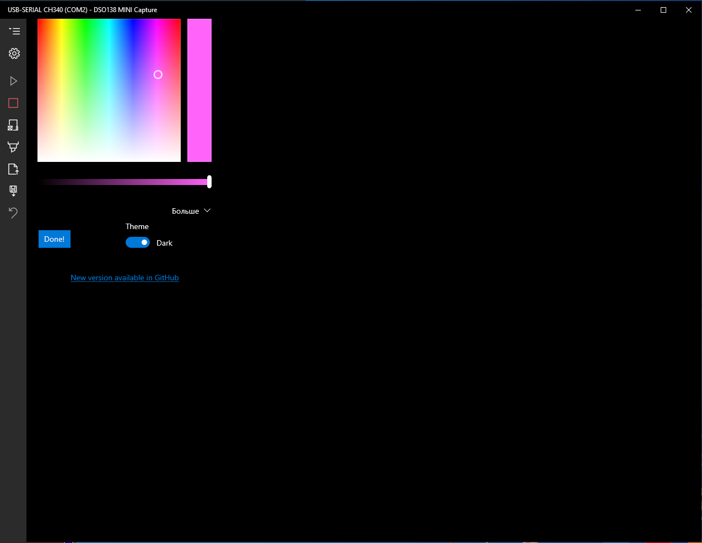

# DSO138 USB Data plot
DSO138 MINI - capture the waveform data and plot, save, export waveform and data.
Windows UWP software, support platform: `x86`,`x64`,`ARM`,`ARM64`

  

  

  

  

  

### waveform some measured and calculated data

```
VSen,1V                - Voltage sensitvity per division
Couple,DC              - Coupling mode, AC, DC, GND
VPos, -3.12V           - Vertical position of the zero Volt line
Timebase,0.5ms         - Time base in time per division
HPos,00362             - Horizontal position offset in sample number (0..1023-320)
TriggerMode,AUTO       - Trigger mode, Auto, Normal, Single
TriggerSlope,Falling   - Trigger slope, Rising, Falling
TriggerLevel,  1.13V   - Trigger Level in Voltage
RecordLength,01024     - Record  Length in number of samples
Vmax,  3.77V           - measured maximum voltage
Vmin,  0.44V           - measured minimum voltage
Vavr,  2.10V           - calculated average voltage
Vpp,  3.28V            - calculated peak to peak voltage
Vrms,  2.67V           - calculated Root-Mean-Square voltage
Freq, 1.036KHz         - measured frequency
Cycl, 0.964ms          - measured cycle time
PW, 0.487ms            - measured pulse width
Duty, 50.5 %           - measured duty cycle
SampleInterval,00020us - sample interval time
```

### Another alternative

[Alternative way](blob/main/Alternative/README.md)  
[rudiswiki.de - JyeTechDSO150](https://www.rudiswiki.de/wiki9/JyeTechDSO150)  
